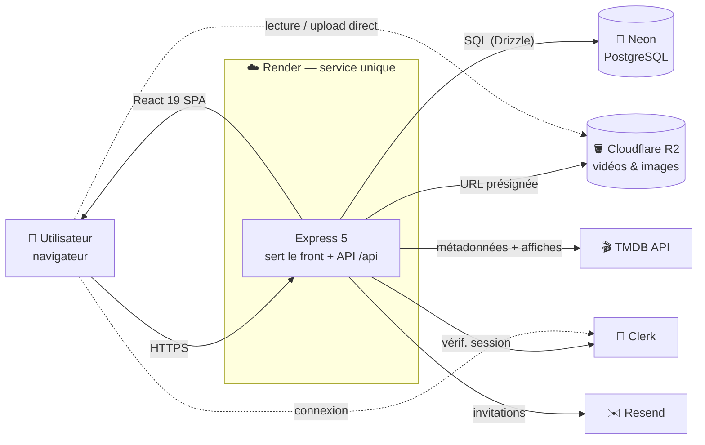
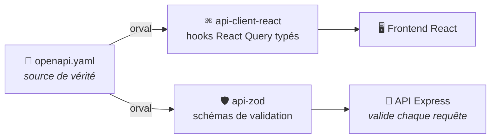
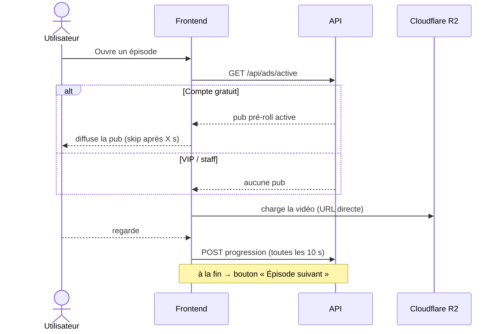

<div align="center">

# 🎬 PiukyFlix

**Plateforme de streaming type Netflix** — catalogue de films & séries, lecteur intégré, uploads directs, intégration TMDB, monétisation (VIP + pub), forum de demandes et un dashboard d'administration complet.

[](https://react.dev)
[](https://expressjs.com)
[](https://www.typescriptlang.org)
[](https://neon.tech)
[](https://orm.drizzle.team)
[](https://clerk.com)
[](https://tailwindcss.com)
[](https://www.themoviedb.org)

🟢 **Démo en ligne** → **[piukyflix.onrender.com](https://piukyflix.onrender.com)**
<sub>(offre gratuite Render — le 1er chargement après inactivité peut prendre ~50 s)</sub>

</div>

---

## Sommaire

- [Aperçu](#aperçu)
- [Fonctionnalités](#fonctionnalités)
- [Architecture](#architecture)
- [Flux contract-first](#flux-contract-first)
- [Modèle de données](#modèle-de-données)
- [Parcours de lecture](#parcours-de-lecture)
- [Stack technique](#stack-technique)
- [Structure du projet](#structure-du-projet)
- [Démarrage en local](#démarrage-en-local)
- [Déploiement](#déploiement)
- [Variables denvironnement](#variables-denvironnement)
- [Commandes](#commandes)
- [Rôles & permissions](#rôles--permissions)
- [Sécurité](#sécurité)
- [Limitations connues](#limitations-connues)

---

## Aperçu

PiukyFlix est un **monorepo pnpm** full-TypeScript. Un seul service **Express** sert à la fois le **frontend React** et l'**API** (déploiement single-service, gratuit sur Render). L'ensemble est **contract-first** : un fichier OpenAPI est la source de vérité d'où sont générés les hooks React Query typés et les schémas de validation.

Côté produit, on a un vrai site de streaming : hero cinématique, carrousels par catégorie, lecteur custom, uploads de fichiers, import automatique des métadonnées depuis TMDB, un système d'abonnement VIP sans pub, une régie de pub pré-roll maison, un forum de demandes, et un back-office riche.

---

## Fonctionnalités

### 👥 Côté public
- **Catalogue** films & séries : **hero cinématique rotatif** (zoom Ken Burns + fondu), **carrousels par catégorie** façon Netflix, barre de catégories (emoji + couleur), fond **aurora animé**.
- **Fiche détail** riche : backdrop, note, **classification d'âge**, tagline, **casting**, **réalisateur**, langue, pays, **bande-annonce**, saisons & épisodes.
- **Lecteur vidéo** HTML5 custom : play/pause, volume, plein écran, reprise à la position, **miniature (poster)**, **enchaînement automatique des épisodes** (bouton « épisode suivant »).
- **Uploads directs** depuis le PC (vidéos & images → Cloudflare R2) **et** support des **liens Google Drive**.
- **Ma liste** (favoris), **historique** & **« Continuer à regarder »** avec barre de progression.
- **Notes** (1-5 ★) et **commentaires** (avec **pseudo**, jamais l'e-mail).
- **Recherche** temps réel (débouncée) et **forum de demandes** (proposer un titre + voter 👍).
- **Connexion obligatoire** (Clerk : e-mail, Google…) et **responsive** mobile / tablette / PC (menu hamburger).

### 🛠️ Côté admin (dashboard)
- **Tableau de bord analytique** : KPIs animés, graphiques (répartition du contenu, top vues, inscriptions/14 j, histogramme des notes), engagement (taux de complétion, actifs 7 j, heures vues), performance par genre, top favoris, répartition des rôles.
- **Gestion du contenu** : table pro (**recherche / tri / pagination / actions groupées**), CRUD films & séries, **édition des saisons & épisodes**, **publication / brouillon** (contenu et épisodes), masquage automatique des épisodes sans vidéo.
- **Intégration TMDB** : recherche + **remplissage automatique** (affiche, durée, casting, réalisateur, bande-annonce, classification…), **import d'une série complète en 1 clic**, et **re-synchronisation** d'une série existante (miniatures/infos manquantes) **sans écraser les vidéos**.
- **Catégories** soignées (icône, couleur, compteur de contenus), **utilisateurs** (recherche, rôles, **statut** actif/suspendu/banni, **VIP**, dernière activité), **invitations** e-mail (suivi d'acceptation, révocation), **publicité** (pubs pré-roll), **demandes** (modération du forum).

### 💸 Monétisation & rôles
- Rôle **VIP** (sans publicité), attribué manuellement par un admin.
- **Pub pré-roll** maison affichée aux comptes gratuits avant la lecture, **sautée** pour les VIP et le staff.

---

## Architecture

Un seul service Render sert le front **et** l'API (`/api/*`, même origine). Les médias sont stockés sur **Cloudflare R2** et servis directement au navigateur.



---

## Flux contract-first

`lib/api-spec/openapi.yaml` est la **source de vérité**. Orval en génère les hooks du frontend **et** les schémas de validation de l'API — impossible d'avoir un front et un back désynchronisés.



---

## Modèle de données

Schéma Drizzle dans [`lib/db/src/schema/`](lib/db/src/schema). Toutes les relations utilisent des **clés étrangères** (cascade ou `set null` selon les cas).

```mermaid
erDiagram
    users ||--o{ favorites : "possède"
    users ||--o{ ratings : "note"
    users ||--o{ comments : "poste"
    users ||--o{ watch_history : "regarde"
    users ||--o{ requests : "demande"
    users ||--o{ request_votes : "vote"
    categories ||--o{ content : "classe"
    content ||--o{ seasons : "contient"
    seasons ||--o{ episodes : "contient"
    content ||--o{ favorites : "aimé par"
    content ||--o{ ratings : "noté par"
    content ||--o{ comments : "commenté"
    requests ||--o{ request_votes : "reçoit"

    users {
        text id PK
        text email
        text username
        enum role
        text status
        bool isVip
    }
    content {
        int id PK
        text title
        enum contentType
        int categoryId FK
        bool isFeatured
        bool isPublished
        int tmdbId
        text maturityRating
    }
    episodes {
        int id PK
        int seasonId FK
        int episodeNumber
        text videoUrl
        text thumbnailUrl
        bool isPublished
    }
    ads {
        int id PK
        text type
        text url
        int durationSeconds
        bool enabled
    }
    requests {
        int id PK
        text title
        text type
        text status
    }
```



> Tables complètes : `users`, `categories`, `content`, `seasons`, `episodes`, `favorites`, `watch_history`, `ratings`, `comments`, `invitations`, `ads`, `requests`, `request_votes`.

---

## Parcours de lecture

Exemple : un utilisateur **gratuit** lance un épisode (pub avant lecture, puis reprise et sauvegarde de la progression).



---

## Stack technique

| Domaine | Technologies |
|---|---|
| **Monorepo** | pnpm workspaces · Node.js 24 · TypeScript 5.9 |
| **API** | Express 5 · Clerk (auth) · Drizzle ORM · PostgreSQL · Zod · Pino |
| **Frontend** | React 19 · Vite 7 · Wouter · TanStack Query · Tailwind CSS v4 · shadcn/ui · Framer Motion · Recharts |
| **Contrat d'API** | OpenAPI → Orval (hooks React Query + schémas Zod) |
| **Stockage médias** | Cloudflare R2 (S3-compatible, uploads présignés) |
| **Métadonnées** | The Movie Database (TMDB) |
| **E-mails** | Resend (invitations) |
| **Build** | esbuild (API, ESM) · Vite (frontend) |

---

## Structure du projet

```
artifacts/
  api-server/         API Express
    src/routes/         content, seasons, userContent, admin, auth, search,
                        categories, tmdb, upload, ads, requests, storage, health
    src/middlewares/    auth (getDbUser / requireStaff / requireAdmin), rateLimit
    src/lib/            utils, logger
  streamflix/         Frontend React
    src/pages/          home, browse, content-detail, watch, search, favorites,
                        history, requests, admin/*
    src/components/     layout (Navbar, AdminSidebar) · content (card, row, preroll)
                        · admin (dashboard UI, TMDB import, file-drop) · ui (shadcn)
lib/
  db/                 Schéma Drizzle + client (lib/db/src/schema/)
  api-spec/           OpenAPI (source de vérité) + config Orval
  api-client-react/   Hooks React Query générés
  api-zod/            Schémas Zod générés
scripts/              Seed du catalogue
```

---

## Démarrage en local

> ⚠️ **Windows / macOS** : le `pnpm-workspace.yaml` épingle des binaires natifs **Linux-x64 uniquement** (esbuild, rollup, tailwind-oxide, lightningcss) → `pnpm install` **échoue en natif**. Utilise **WSL2** ou **Docker**, ou développe/déploie directement sur Linux (Render).

```bash
# 1. Installer (sous Linux / WSL2)
pnpm install

# 2. Environnement
cp .env.example .env      # renseigner les valeurs (voir plus bas)

# 3. Créer le schéma DB
pnpm --filter @workspace/db run push

# 4. (Optionnel) Contenu de démo
pnpm --filter @workspace/scripts run seed

# 5. Lancer (deux terminaux)
pnpm --filter @workspace/api-server run dev   # API   → :8080 (/api)
pnpm --filter @workspace/streamflix run dev   # Front → /
```

---

## Déploiement

Hébergement **gratuit, 24/7** : un seul service **Render** (API + frontend) + base **Neon** + auth **Clerk** + stockage **Cloudflare R2** + métadonnées **TMDB**. Pas à pas dans **[DEPLOY.md](DEPLOY.md)** ; configuration dans [`render.yaml`](render.yaml). Pour transférer le projet à un autre propriétaire : **[HANDOVER.md](HANDOVER.md)**.

Le build Render exécute automatiquement : `pnpm install` → build front & API → `drizzle push` (migrations) → seed → codegen. Le `index.html` est servi en `no-cache` (les assets versionnés en `immutable`) pour que chaque déploiement s'affiche immédiatement.

---

## Variables d'environnement

Liste complète et commentée dans [`.env.example`](.env.example). À définir dans le dashboard Render (`sync:false`).

| Variable | Rôle | Requis |
|---|---|:---:|
| `DATABASE_URL` | Connexion PostgreSQL (Neon) | ✅ |
| `CLERK_PUBLISHABLE_KEY` · `CLERK_SECRET_KEY` | Auth (backend) | ✅ |
| `VITE_CLERK_PUBLISHABLE_KEY` | Auth (frontend, injectée au build) | ✅ |
| `REPLIT_DOMAINS` | Hôtes publics → allowlist CORS + liens e-mails | ✅ (prod) |
| `SERVE_CLIENT` | `true` → l'API sert le frontend (single-service) | prod |
| `TMDB_API_KEY` | Métadonnées & affiches (import / auto-fill / sync) | recommandé |
| `R2_ENDPOINT` · `R2_ACCESS_KEY_ID` · `R2_SECRET_ACCESS_KEY` · `R2_BUCKET` · `R2_PUBLIC_URL` | Uploads de fichiers (Cloudflare R2) | pour l'upload |
| `ADMIN_EMAILS` | E-mails promus admin à la connexion (séparés par virgules) | — |
| `RESEND_API_KEY` | Envoi des invitations par e-mail | — |

---

## Commandes

| Commande | Effet |
|---|---|
| `pnpm run build` | Typecheck + build de tous les packages |
| `pnpm --filter @workspace/api-server run dev` | Lancer l'API en dev |
| `pnpm --filter @workspace/streamflix run dev` | Lancer le frontend en dev |
| `pnpm --filter @workspace/api-server run test` | Tests unitaires de l'API |
| `pnpm --filter @workspace/db run push` | Appliquer le schéma DB |
| `pnpm --filter @workspace/scripts run seed` | Insérer le contenu de démo (idempotent) |
| `pnpm --filter @workspace/api-spec run codegen` | Régénérer hooks + schémas Zod depuis l'OpenAPI |

---

## Rôles & permissions

| Rôle | Accès |
|---|---|
| **user** | Navigation, lecture, favoris, notes, commentaires, demandes. **Voit les pubs.** |
| **vip** *(flag `isVip`)* | Comme `user`, mais **sans publicité**. Attribué manuellement par un admin. |
| **moderator** | + gestion du **contenu** (films, séries, catégories, épisodes), des **demandes**, des **pubs**, et accès au dashboard. |
| **admin** | + gestion des **utilisateurs** (rôles, statut, VIP), des **invitations**, et de tout le reste. |

Le premier admin se crée via `ADMIN_EMAILS` (promu à la connexion) ; il peut ensuite promouvoir d'autres comptes depuis le dashboard. Un compte **banni** est bloqué sur toutes les actions authentifiées.

---

## Sécurité

- **Validation** des requêtes d'écriture via les schémas Zod générés ; les clés inconnues sont rejetées (anti mass-assignment).
- **Autorisation** à 3 niveaux (`getDbUser` / `requireStaff` / `requireAdmin`) ; la gestion des utilisateurs et des invitations est réservée aux admins.
- **CORS** restreint aux hôtes autorisés ; **rate limiting** en mémoire (global + renforcé sur `/api/auth` et `/api/admin/invite`).
- **E-mails d'invitation** échappés (anti-injection HTML) ; **uploads** réservés au staff (URLs présignées).
- **Clés étrangères + cascades** au niveau base.
- **Contenus et épisodes non publiés / sans vidéo** invisibles côté public.

---

## Limitations connues

- **Local Windows/macOS** : impossible nativement (binaires Linux-x64) → WSL2, Docker ou Linux.
- **Offre gratuite Render** : l'instance s'endort après ~15 min d'inactivité (1er accès ~50 s).
- **Rate limiting** en mémoire (par instance) : non partagé en cas d'autoscale.
- **Pub / TMDB / uploads** nécessitent leurs clés respectives (sinon la fonctionnalité est simplement inactive, sans casser le site).

---

<div align="center">
<sub>Fait avec ❤️ — React · Express · PostgreSQL · TMDB · Cloudflare R2</sub>
</div>
